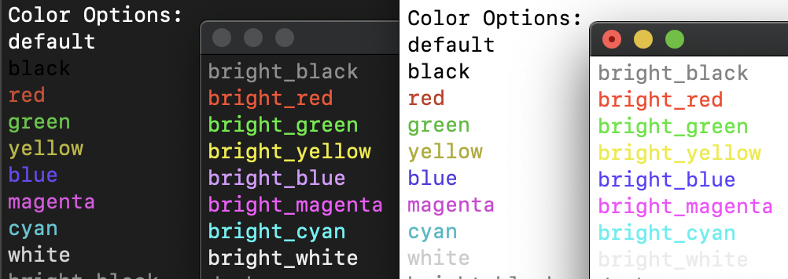
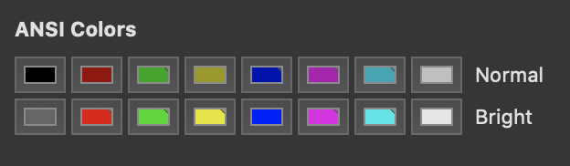

# Motion::Lager 🍺

Full featured logger for use in RubyMotion apps.

## Installation

Add this line to your application's Gemfile:

    gem 'motion-lager'

And then execute:

    $ bundle

## Usage

1. Initialize an instance of the logger. Tip: assign it to a global (like `$log`) for easy access anywhere in your app.
    ```ruby
    logger = Motion::Lager.new(level: 'debug') # default
    ```

2. Next, call a log level method and pass the message or object that you'd like to log. Log level methods are: `debug`, `info` (or `log`), `warn`, and `error`. You can also specify the name of a color if you'd like to override the default text color for that log level. You can also specify the background color as the third argument.
    ```ruby
    logger.debug 'My debug message'
    logger.debug my_object # pretty print objects
    logger.debug 'Success!', :green
    logger.warn 'Warning: Black on Yellow!', :black, :yellow
    ```

### Color Options



Note: Actual color may vary depending on console preferences. Example from Terminal app:



## Contributing

1. Fork it
2. Create your feature branch (`git checkout -b my-new-feature`)
3. Commit your changes (`git commit -am 'Add some feature'`)
4. Push to the branch (`git push origin my-new-feature`)
5. Create new Pull Request
